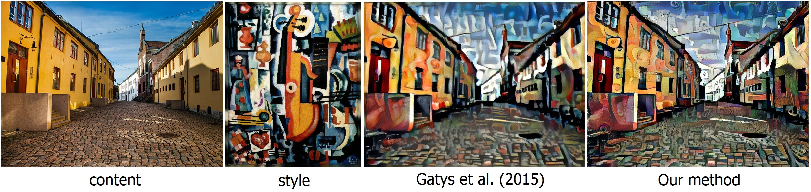
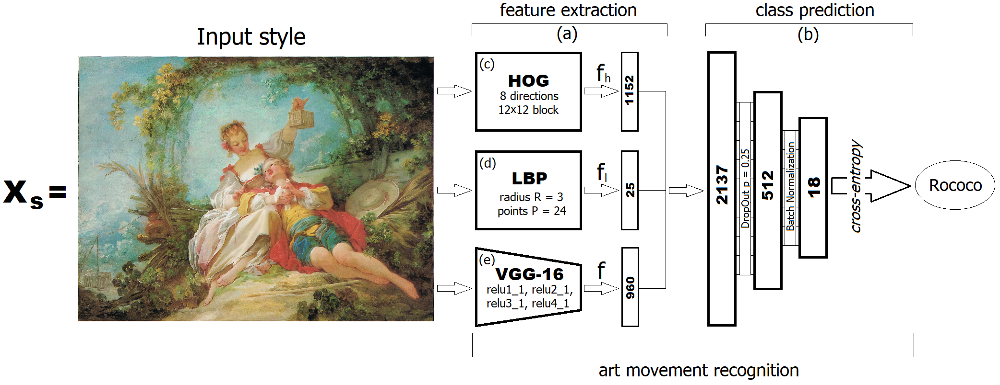
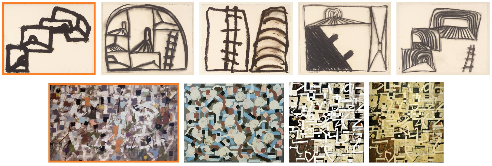
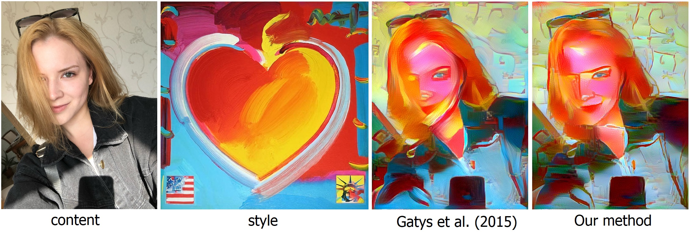
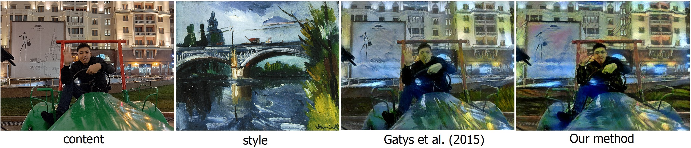
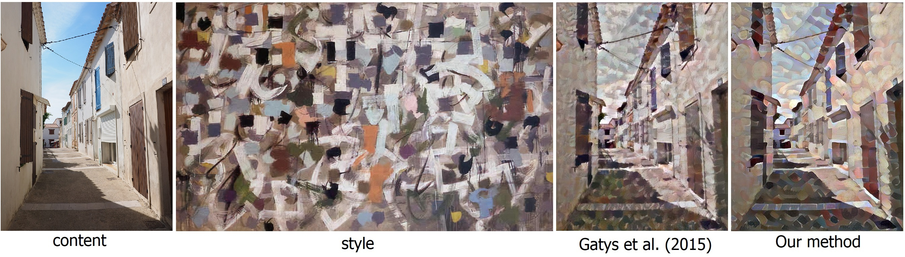

# Style-transfer-using-extended-styles-collection  
This is realizaion of Automatic style transfer for images using extended styles collection.  

  

## Art movement recognition scheme  
  

## Similar images
  

All results of programs is in `output` folder.  
## Stylization  
`python test.py --content <content path> --style <style path>`  
## Database creating  
`python ./create_database.py`  
## Training
`python ./train.py`  
## Examples  

   

   

  

